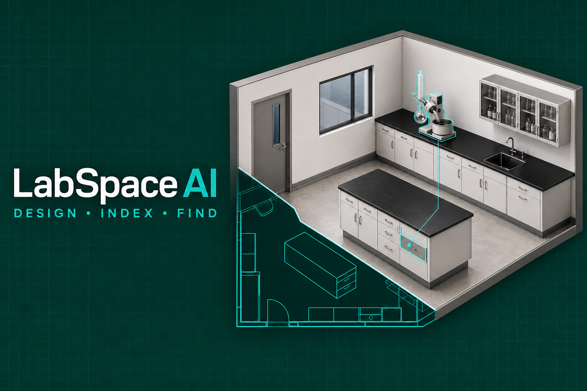
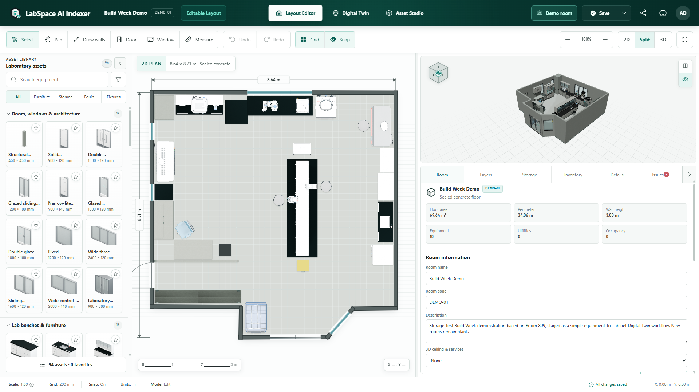
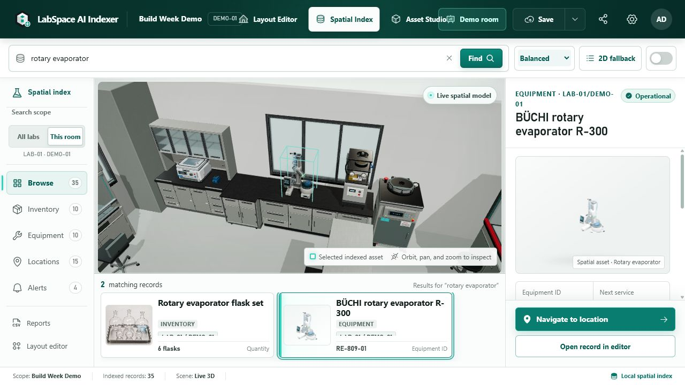
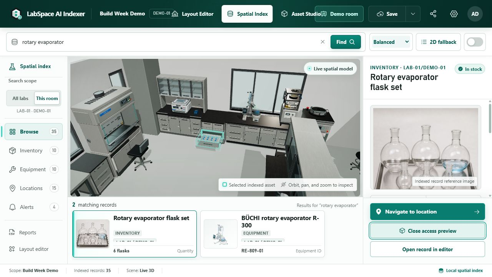
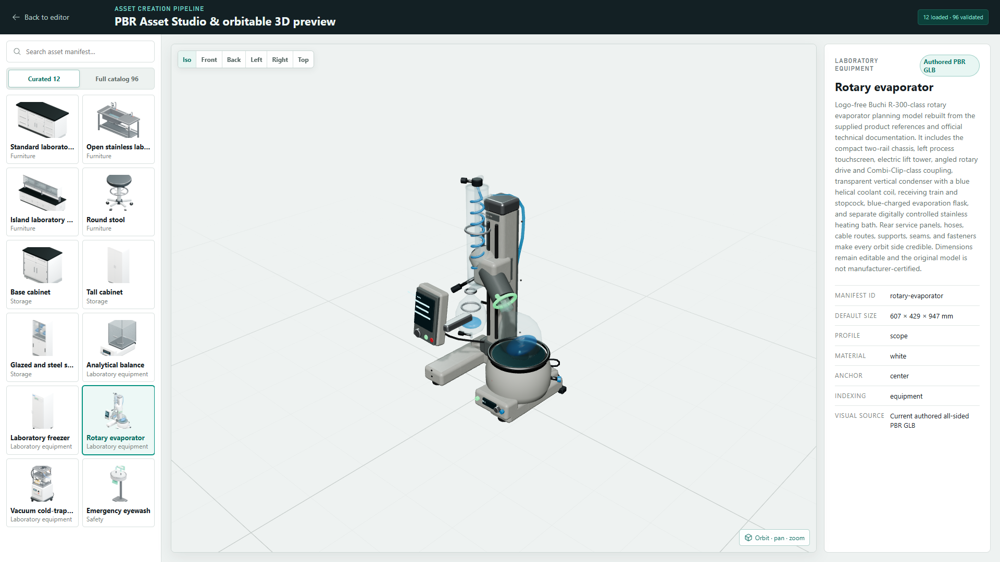

# LabSpace AI Agent Twin

<p align="center">
  
</p>

<p align="center"><strong>Design the lab. Index every location. Find anything instantly.</strong></p>

**LabSpace AI Agent Twin** is a local-first, multi-laboratory spatial operating system where researchers and browser agents can design rooms, index physical storage, audit deterministic placement evidence, and navigate exact equipment or inventory locations. Its synchronized 2D/3D editor uses millimetre-accurate scene data, local SQLite persistence, versioning, labels, reports, and validation. The compact in-product brand remains **LabSpace AI**, while the competition name identifies the browser-agent-enabled edition. The included competition showcase is **DEMO-01**; its laboratory character and selected spatial references were informed by the author's Room 809 laboratory, but Room 809 is not the demo's identity or a feature boundary.

## WebMCP Challenge — LabSpace AI Agent Twin

**WebMCP for the physical laboratory.** LabSpace now lets a browser agent work with a structured semantic digital twin instead of scraping pixels or guessing what laboratory controls mean. The agent can create and activate a genuinely blank room, infer its building floor, calculate a rectangular or multi-wall polygon shell, host doors and windows on exact wall segments, pair chairs with workstations, orient perimeter furniture inward, and place bench equipment on real support surfaces. It can also search exact physical records, focus the real 2D/3D workspace, validate equipment moves, and propose project inventory at canonical locations.

**Live judge demo:** [labspace-agent-twin.onrender.com](https://labspace-agent-twin.onrender.com) — open **Demo room** for the preserved DEMO-01 showcase. The free instance can take up to about a minute to wake after inactivity.

The trust boundary is human-controlled and risk-based. Every application session starts in **Reviewed** mode: room creation, blueprints, inventory, movement, and resizing stop at **Preview · not saved** until a researcher approves them. The visible **Fast Draft** opt-in can auto-apply only a validated additive blank room and that room's complete first blueprint; the blueprint is one undoable history update. Existing-room layouts, moves, resizes, inventory/stock, destructive changes, incomplete plans, and validation failures always escalate to review. No WebMCP argument can select or bypass the mode, and there is no agent-accessible approve, reset, delete, import, or unrestricted project-write tool.

### See WebMCP working

Open the **WebMCP** status control in the LabSpace header. Its inspector makes the browser integration visible without DevTools:

1. **Registered tools** shows the twenty-three live browser tools and their Read, View, Simulate, Create, or Review boundary.
2. **Run read-only check** invokes `labspace_get_context` through `document.modelContext.executeTool`.
3. **Live activity** shows the real tool name plus bounded structured Input and Result evidence.
4. **Agent workflows** provides seven copy-ready, compositional prompts for inventory, collection, building, annexes, locating, auditing, and resizing without adding a competing chatbot UI.
5. **Use WebMCP** explains where to type natural-language prompts and distinguishes that flow from Chrome DevTools' one-tool-at-a-time JSON runner.

Type the suggested request in the ChatGPT/browser-agent conversation that opened LabSpace. LabSpace does not add a second chatbot: the browser agent discovers the tools directly from the open page, and the inspector shows each call inside the product.

The trace is intentionally evidence, not hidden model reasoning. Ordinary researcher clicks are not mislabeled as agent activity. Human mode changes, reviewed proposals, Fast Draft commits, approvals, cancellations, and Undo-capable commits are recorded as distinct evidence.

### Twenty-three browser-native tools

| Tool                             | Capability                                                                           | Saved-data behavior                                             |
| -------------------------------- | ------------------------------------------------------------------------------------ | --------------------------------------------------------------- |
| `labspace_audit_room`            | Audit floor closure, boundaries, support, hosted openings, overlaps, height, and IDs | Read-only; deterministic readiness evidence                     |
| `labspace_create_room`           | Propose one genuinely blank room in a selected laboratory                            | Reviewed by default; bounded Fast Draft additive write          |
| `labspace_get_context`           | Read the active project, room, selection, and index counts                           | Read-only                                                       |
| `labspace_search_records`        | Search equipment, inventory, and exact storage                                       | Read-only                                                       |
| `labspace_inspect_record`        | Inspect current canonical evidence                                                   | Read-only                                                       |
| `labspace_focus_record`          | Reveal a record in the normal room, evidence panel, and camera                       | Presentation state only                                         |
| `labspace_search_assets`         | Discover openings and planning assets with dimensions and connection behavior        | Read-only                                                       |
| `labspace_plan_room`             | Propose a polygon shell, hosted openings, paired workstations, and supported assets  | Read-only                                                       |
| `labspace_plan_annex`            | Split one stable wall and validate a connected space with an independent floor       | Read-only                                                       |
| `labspace_inventory_locations`   | Discover canonical inventory destinations in editable rooms                          | Read-only                                                       |
| `labspace_plan_inventory`        | Validate proposed project-wide inventory records and assignments                     | Read-only                                                       |
| `labspace_find_valid_placements` | Rank diverse valid alternatives near a preferred area using current geometry         | Read-only                                                       |
| `labspace_validate_object_move`  | Test a hypothetical position with current geometry                                   | Read-only                                                       |
| `labspace_stage_object_move`     | Show a reversible valid-move preview                                                 | Not persisted; human approval required                          |
| `labspace_validate_resize`       | Test dimensions, hosted-wall fit, sill height, and opening overlap                   | Read-only                                                       |
| `labspace_stage_resize`          | Show a reversible dimension-accurate preview                                         | Not persisted; human approval required                          |
| `labspace_stage_inventory_plan`  | Show a human-reviewable inventory proposal                                           | Not persisted; human approval required                          |
| `labspace_stage_room_plan`       | Stage a complete blueprint                                                           | Reviewed by default; Fast Draft only for a pristine first build |
| `labspace_stage_annex_plan`      | Stage one connected annex transaction                                                | Not persisted; human approval always required                   |
| `labspace_add_inventory`         | Validate and stage detailed inventory entries in one call                            | Human approval required before records are created              |
| `labspace_resolve_materials`     | Match a suggested materials list to actual stock and equipment                       | Read-only; missing and ambiguous matches stay explicit          |
| `labspace_start_collection`      | Start a room-grouped guide from reviewed canonical records                           | Presentation state only; no stock deduction                     |
| `labspace_collection_step`       | Status, Next, Previous, or finish for the collection guide                           | Presentation state only                                         |

```text
browser agent → document.modelContext → LabSpace tool adapter
                                      → human-controlled execution policy
                                      → Reviewed → visual proposal → researcher Approve / Cancel
                                      → Fast Draft → validated additive room + first blueprint only
                                      → history + autosave + Undo + bounded activity evidence
```

This challenge work extends the pre-existing LabSpace application. The annotated `pre-webmcp-2026-08-27` tag preserves the verified boundary; later challenge commits add the WebMCP adapter, shared actions, deterministic validation, capability-scoped initial-room creation, human-reviewed later changes, Agent Activity evidence, evals, and independent browser workflow tests. See the [WebMCP judge guide](docs/webmcp/JUDGE_GUIDE.md), [architecture](docs/webmcp/ARCHITECTURE.md), and [challenge evidence](docs/webmcp/CHALLENGE_EVIDENCE.md).

The runtime remains local and no-billing: LabSpace embeds no model, sends no model API request, and needs no OpenAI API key. Intelligence comes from the user's WebMCP-capable browser agent; LabSpace supplies deterministic domain tools, a human-controlled execution policy, and the visible review surface.

## Finalized product tour

### Layout Editor

The complete planning workspace combines the searchable 94-asset library, material-aware 2D plan, synchronized 3D room, editable room data, and surface controls in one desktop composition.



### Spatial Index Finder and exact-location evidence

The Spatial Index Finder searches canonical equipment, inventory, rooms, and storage paths, then navigates from the selected record to precise room and cabinet evidence.

**Inventory → Storage** opens a full-size workspace with a searchable cabinet rail, anatomy-derived **storage map**, inline naming, readable contents and an opt-in **3D access preview** using the original models and materials. Assign existing stock or add a record at an exact shelf; custom/unlinked locations remain available through the complete location directory. The Layout Editor's Storage Inspector is now a contextual summary with **Manage storage**, and returning preserves the editor view and selection. Inventory rows show images, quantities, units and batch-selection checkboxes. Assignments, renames and storage configuration are undoable without rolling back newer stock quantities. See the [inventory organization guide](docs/INVENTORY_ORGANIZATION.md).

<table>
  <tr>
    <td width="50%">
      
      <br /><strong>Equipment focus:</strong> deterministic project search, room navigation, equipment identity, service evidence, and one precise spatial selection.
    </td>
    <td width="50%">
      
      <br /><strong>Storage proof:</strong> Drawer 02 opened in place with the inventory photograph, canonical location trail, quantity, owner, and QR identity.
    </td>
  </tr>
</table>

### PBR Asset Studio

Authored laboratory models remain orbitable and inspectable from every side, with validated dimensions, materials, indexing behavior, catalog thumbnails, and the same GLB used in the room renderer.



## Highlights

- One canonical, versioned scene model drives React Konva 2D and React Three Fiber 3D.
- A project navigator creates and switches among multiple laboratories and rooms; generic project/laboratory/room factories never clone demonstration content into a blank workspace.
- A dedicated project-wide Spatial Index Finder searches inventory, equipment, and nested storage locations across every laboratory and room, switches the live spatial scene to a selected result, highlights the related 3D asset or drawer/shelf/bin region, and deep-links back to the same room and editor record.
- Every room owns semantic scene-local layers for walls, openings, furniture, storage, equipment, utilities, safety, labels, and measurements, so placement never depends on seed-owned layer IDs.
- Laboratory-aware object indexes and equipment IDs use the active laboratory, room, and optional zone codes with normalized, case-insensitive uniqueness checks.
- 106 original planning definitions across architecture, furniture, storage, equipment, and safety (including two hidden wall primitives).
- All 104 user-visible library assets use authored, genuinely orbitable GLB geometry with front, back, side, top construction, and dimension-matched catalog/plan renders.
- The authored set now includes detailed benches and wash stations, core casework/storage, professional openings, a raised-service-bridge island, a fully rebuilt BÜCHI R-300-class touchscreen rotary evaporator, and manufacturer-class analytical, thermal, cold-storage, imaging, washing, and clean-air equipment.
- All 106 catalog definitions supply material-aware isometric library images and top-view plan images derived from the same authored GLB or procedural geometry used by the 3D view.
- Only `straight-wall` and `half-height-wall` remain procedural because they are hidden construction primitives controlled by the wall-drawing workflow, not draggable Asset Library products.
- A visible Asset Studio provides an orbitable PBR preview plus front, back, left, right, top, and isometric camera presets.
- Interactive select, marquee, pan, wall, door, window, measure, move, resize, rotate, copy, paste, duplicate, delete, lock, hide, and z-order actions.
- Newly created laboratories and rooms open with genuinely blank planning canvases; **DEMO-01** remains available separately as the competition showcase.
- DEMO-01 uses a user-authored, storage-first workflow informed by selected layout and equipment references from the author's Room 809 laboratory. It remains separate from the blank planning canvas. The factory demo source is immutable; creating or saving a demo produces a normal persisted room and never rewrites the template.
- Selected wall segments can be translated directly or reshaped from endpoint handles while joined corners and hosted openings remain attached.
- One simple closed straight-wall loop defines the floor: rectangles, concave L-shapes, split edges, and skewed loops share one clipped 2D floor, triangulated 3D floor, area/perimeter result, placement boundary, and normalized undoable resize.
- Placed objects keep a reliable hit area and pointer-relative drag offset, and Select mode pans with middle-mouse drag, Space+drag, Arrow keys, or WASD.
- Continuous wall drawing carries each committed endpoint into the next segment; Enter or double-click finishes a chain, while Escape returns to Select.
- Grid, multi-surface snapping, alignment guides, pointer-centred zoom, fit-to-room, camera presets, wall transparency, and floor visibility.
- Split presentation has a draggable, keyboard-accessible, persistent divider with protected minimum pane widths.
- Rooms without a saved camera pose open with the user-approved relaxed split-view isometric framing; manual orbit poses persist per room, and ordinary 2D object moves never reset the 3D camera.
- The Asset Library and Inspector collapse into narrow, labeled, keyboard-accessible rails when more canvas space is needed.
- A dedicated Favorites tab gives quick access to starred assets; stars update immediately, persist safely across reloads, and remain usable for the current session even when browser storage is unavailable.
- Optional room environment profiles can add 3D-only ceiling, lighting, duct, utility, and service context without altering the indexed scene. The DEMO-01 reference-services profile is the first bundled example and remains independently hideable.
- Visual material libraries synchronize ten floor finishes and ten wall finishes between the 2D plan and 3D PBR room, including porcelain, pearl terrazzo, pale oak, ivory stone, and satin panels with per-wall overrides. Decorative office finishes are not wet-laboratory certification.
- Cabinet, shelf, drawer, compartment, and bin hierarchies with stable codes and exact inventory locations.
- Equipment identity, service, ownership, and utility requirements.
- Readable desktop typography uses a 12px visible minimum, 13px labels, and 14px controls/body text without shrinking the CAD workspace.
- Revision-aware autosave, presentation-safe renderer mounting, contained pane errors, and guarded Konva drag handling protect live edits from stale saves, blank views, and upper-corner snapping.
- Named room versions, restore, version-to-room duplication, and portable JSON import/export.
- QR labels, A4 print layouts, and CSV reports.
- Collision, boundary, door-swing, hierarchy, duplicate code, equipment ID, and serial-number warnings.

## Spatial Index Finder and browser-agent API

The competition workflow is fully testable without an OpenAI Platform API key or usage billing. The **Spatial Index Finder** performs deterministic multi-term search over canonical equipment, inventory, laboratory, room, owner, note, identifier, cabinet, drawer, shelf, compartment, and bin data. Selecting a result controls the existing 2D/3D focus, evidence inspector, QR identity, editor deep link, and opt-in physical access preview.

There is no embedded model response in the shipped runtime. GPT-5.6 and Codex were used to build and validate the product, as documented separately below. A WebMCP-capable browser agent can now discover and invoke LabSpace's twenty-three structured tools, while the canonical catalog, room and annex planners, room-readiness audit, inventory planner, index, geometry validator, capability gate, and human review UI remain deterministic application behavior.

The Spatial Index renders every visible object in the active room so evidence always matches the Layout Editor. Performance comes from local assets, shared geometry/material reuse, offline decoders, loading discipline, and detail management rather than hiding room contents. The Layout Editor exposes the complete searchable 104-asset library, while Asset Studio loads one orbitable model at a time and releases the previous preview cache.

**Low / Balanced / High rendering** is shared across the editor, Spatial Index, Facility and Asset Studio. Balanced is the default with a one-click reset; High adds restrained contact shading and cached finish microtexture at extra GPU cost. Clear panes retain their transparent blue accent. Quality changes preserve camera, selection, storage openings and saved room data. See the [rendering comparison and rollback notes](docs/local-render-quality.md).

## Start locally

Requirements: Node.js 22.5 or newer (Node.js 24 LTS is recommended). The built-in SQLite module is the only platform-sensitive runtime requirement.

### One-click Windows launcher

After installing Node.js, Windows users can double-click **[`Start LabSpace.cmd`](Start%20LabSpace.cmd)** in the repository root. The launcher installs missing npm dependencies, keeps the required port `3004`, avoids starting a duplicate server, waits until LabSpace is reachable, and opens the application in the default browser. Keep the minimized **LabSpace AI Server** terminal open while using the application.

### Terminal launch

```powershell
git clone https://github.com/MuhammedJshi96/LabSpace-AI-Indexer.git
cd LabSpace-AI-Indexer
npm ci
npm run dev
```

Open [http://127.0.0.1:3004/](http://127.0.0.1:3004/). The searchable spatial index is available at [http://127.0.0.1:3004/digital-twin](http://127.0.0.1:3004/digital-twin), and the asset pipeline preview is available at [http://127.0.0.1:3004/asset-preview](http://127.0.0.1:3004/asset-preview).

For a non-technical Windows walkthrough, see [SETUP.md](SETUP.md).

## Clean clone and judge setup

### Latest competition polish

Storage access now opens the **actual authored door leaves and drawer trays**,
with correct hinge sides, internal shelves, per-instance animation and a safe
explanation when saved storage does not match a model. It never overlays an
invented door or fabricates stored contents. Five verified casework families are
covered; see [model-aware storage access](docs/assets/storage-access-2026-08-30.md).
This release also includes the scoped furniture refinements, viewport-fitted
Asset Studio, dismissible spatial selection, and dialogs above the header.

The live release now includes a one-call reviewed inventory tool, material-list grounding, and a visible Next/Previous collection guide; richer floor/wall finishes; chair-to-desk knee-space snapping; and upgraded authored workstation/desk models. See [Inventory and collection workflows](docs/webmcp/INVENTORY_AND_COLLECTION.md) for exact tool arguments and examples. The guide is a grounded collection itinerary, not an experiment protocol or certified walking route.

The public service uses the explicitly published local five-room project snapshot. Local fresh installations continue to use the blank starter plus separate DEMO-01 seed described below. Neither path overwrites the developer's existing SQLite workspace.

The repository is self-contained: authored GLBs, plan/library renders, inventory evidence images, material textures, and offline Draco decoder files live under `public/` and are copied into the production bundle by Vite. Judges do **not** need Blender, the private reference photographs, an OpenAI API key, or an asset-rebuild step.

```powershell
git clone https://github.com/MuhammedJshi96/LabSpace-AI-Indexer.git
cd LabSpace-AI-Indexer
npm ci
npm run release:check
npm run dev
```

The server creates a new local SQLite database from the source-controlled seed on first launch. SQLite files, local reference photographs, browser-test output, generated caches, and bulk QA captures are intentionally excluded from Git. The seed opens on an empty planning canvas and includes the user's complete sanitized **DEMO-01** video-showcase room. Choose **Demo room** in the header to open that full room immediately. An immutable 12-object factory template is also retained only as an optional copy/reset utility; it is not a reduced build and does not replace any website code or DEMO-01 content. Copying the developer SQLite database is neither required nor recommended.

For the WebMCP Challenge, see [docs/webmcp/JUDGE_GUIDE.md](docs/webmcp/JUDGE_GUIDE.md). The earlier Build Week guide remains at [docs/submission/JUDGE_GUIDE.md](docs/submission/JUDGE_GUIDE.md).

## Commands

| Command                            | Purpose                                                   |
| ---------------------------------- | --------------------------------------------------------- |
| `npm run dev`                      | Start the local API and Vite development server           |
| `npm run build`                    | Create the production frontend bundle                     |
| `npm run start`                    | Start the API and serve the production bundle             |
| `npm run assets:build`             | Rebuild the 104 visible hero GLBs and 208 catalog renders |
| `npm run assets:render-procedural` | Rebuild four wall-primitive procedural catalog renders    |
| `npm run lint`                     | Run ESLint                                                |
| `npm run typecheck`                | Run strict TypeScript checks                              |
| `npm run test`                     | Run the Vitest unit/integration suite                     |
| `npm run test:e2e`                 | Run the Playwright competition and editor workflows       |
| `npm run test:e2e:webmcp`          | Run the independent WebMCP judge workflow                 |
| `npm run validate:assets`          | Validate manifests, authored GLBs, and static PNG renders |
| `npm run release:check`            | Run lint, types, asset validation, tests, and build       |
| `npm run format`                   | Format source and documentation                           |

`npm run assets:build` uses Blender 4.5 LTS. It resolves the project-local portable build by default, or a compatible executable supplied through `BLENDER_PATH`.

## Local data

The active database is `<repository>/data/labspace-indexer.sqlite`. No project data, analytics, or telemetry leaves the computer. JSON export is the portable backup format.

## How I used GPT-5.6 and Codex

I am a biologist, not a programmer. I supplied the laboratory knowledge, Room 809 reference photographs, equipment requirements, product priorities, visual direction, testing feedback, and final acceptance decisions. The project was developed through repeated human–AI collaboration rather than a one-prompt generation process.

- **GPT-5.6 — product reasoning and design translation:** GPT-5.6 helped translate laboratory observations into workflows, information architecture, spatial-data requirements, interaction contracts, asset specifications, competition positioning, and clear acceptance criteria. It helped me reason about how an empty-room builder, synchronized 2D/3D editing, exact storage indexing, and deterministic search should operate as one coherent product.
- **Codex — implementation and verification:** Codex worked directly in the repository to implement the React, TypeScript, Three.js, React Konva, Express, and SQLite application. It built and refined synchronized editor behavior, wall and opening workflows, asset tooling, persistence, validation, search navigation, tests, documentation, and release checks. It also diagnosed failures I reported through hands-on testing and screenshots, including corner snapping, disappearing objects, camera resets, stale saves, and renderer lifecycle problems.
- **My role — domain authority and product decisions:** I evaluated every result from a laboratory-user perspective, corrected equipment anatomy and proportions, selected priorities, rejected unsuitable implementations, authored the DEMO-01 showcase, and decided when each workflow was acceptable. Codex made developing a professional tool approachable despite my lack of programming experience, while the laboratory and product judgment remained mine.

The shipped Spatial Index is deterministic local software and requires no OpenAI API key or paid API billing. The primary Codex build session retained for the required `/feedback` evidence is `019f6a4d-25a9-7812-804c-88b695589b2a`.

## WebMCP local test and deployment

Use a WebMCP-capable ChatGPT in-app browser for the easiest natural-language flow. In Chrome, enable `chrome://flags/#enable-webmcp-testing`; to use Chrome's DevTools WebMCP pane, also enable `chrome://flags/#devtools-webmcp-support`. On `/` or `/digital-twin`, run:

```js
const tools = await document.modelContext.getTools();
tools.map((tool) => tool.name);
```

The result should contain exactly the twenty-three tools listed above. Full commands and the deterministic demo workflows are in [docs/webmcp/LOCAL_TESTING.md](docs/webmcp/LOCAL_TESTING.md).

The repository includes [`render.yaml`](render.yaml) for a no-billing Render web service. It builds with `npm ci --include=dev && npm run build`, starts Express, and checks `/api/health`. The public app automatically saves its full project and named room versions in **IndexedDB in the current browser**. “Saved in this browser” confirms a completed disk transaction. Refresh, server-session expiry, Render restart and redeployment do not replace that saved project. First-time visitors adopt their existing isolated server session (or the approved starter snapshot); other browsers remain independent. Older tabs cannot silently overwrite newer saves. This is same-browser/device storage, not account or cloud sync: export JSON before clearing site data, leaving private browsing, or changing computers. Local SQLite and the automated-test seed remain separate. See [docs/webmcp/DEPLOYMENT.md](docs/webmcp/DEPLOYMENT.md).

## Build Week scope and authorship

Before Build Week, the project had a local laboratory layout/indexing prototype, a canonical scene schema, and an early procedural asset catalog. During the competition period, the work concentrated on the judgeable spatial-digital-twin workflow:

- immutable demo-template ownership plus user-owned Demo Room persistence;
- synchronized, material-aware 2D/3D editing with camera-preserving object movement;
- exact cabinet, shelf, drawer, compartment, and bin indexing;
- project-wide Spatial Index search, photographic result evidence, and exact-location camera navigation;
- direct Layout Editor placement warnings backed by deterministic geometry validation;
- a restrained 12-object DEMO-01 factory template with one BÜCHI station and assigned flask evidence;
- the user's full DEMO-01 video-showcase room as a sanitized source-controlled fixture with its authored layout, indexed equipment, inventory, and exact storage hierarchy;
- authored GLB asset delivery, offline Draco decoding, regression tests, release checks, and submission documentation.

The Build Week work followed the responsibility split documented in **How I used GPT-5.6 and Codex**: I supplied the laboratory expertise and made the product decisions; GPT-5.6 helped structure requirements and workflows; and Codex implemented, debugged, tested, and documented the working system. A possible LabSpace AI API remains a clearly labeled future extension rather than a claimed runtime feature.

See [docs/submission/BUILD_WEEK_IMPLEMENTATION.md](docs/submission/BUILD_WEEK_IMPLEMENTATION.md) for the architecture, originality boundary, human/AI collaboration record, and measured demo facts.

## Technology

React 19, TypeScript strict mode, Vite, Express, Node's SQLite module, Zustand, Zod, React Konva, Three.js, React Three Fiber, Drei, Phosphor Icons, QRCode, Vitest, and Playwright. See [ARCHITECTURE.md](ARCHITECTURE.md) for tradeoffs.

## Documentation

- [SETUP.md](SETUP.md) — Windows installation and daily use
- [ARCHITECTURE.md](ARCHITECTURE.md) — system boundaries and technical decisions
- [DATA_MODEL.md](DATA_MODEL.md) — versioned domain schema
- [ASSET_GUIDE.md](ASSET_GUIDE.md) — manifest and asset authoring pipeline
- [docs/EQUIPMENT_REFERENCE_MATRIX.md](docs/EQUIPMENT_REFERENCE_MATRIX.md) — official manufacturer references for reusable laboratory-equipment GLBs
- [docs/DIGITAL_TWIN_WORKSPACE.md](docs/DIGITAL_TWIN_WORKSPACE.md) — Spatial Index Finder behavior, record trace contract, and fidelity boundary
- [ASSET_LICENSES.md](ASSET_LICENSES.md) — asset provenance
- [LICENSE](LICENSE) — Apache License 2.0 for application source code
- [LICENSE-ASSETS.md](LICENSE-ASSETS.md) — separate terms for models, renders, media, references, and branding
- [NOTICE](NOTICE) — attribution and trademark boundary
- [INDEXING_SYSTEM.md](INDEXING_SYSTEM.md) — code rules and storage hierarchy
- [KEYBOARD_SHORTCUTS.md](KEYBOARD_SHORTCUTS.md) — editor controls
- [TESTING.md](TESTING.md) — automated and manual validation
- [ROADMAP.md](ROADMAP.md) — limitations and recommended next phase
- [SECURITY_NOTES.md](SECURITY_NOTES.md) — local security model
- [docs/webmcp/JUDGE_GUIDE.md](docs/webmcp/JUDGE_GUIDE.md) — rapid WebMCP judge workflow
- [docs/webmcp/CHALLENGE_SCORECARD.md](docs/webmcp/CHALLENGE_SCORECARD.md) — evidence-based judging-criteria audit
- [docs/webmcp/ARCHITECTURE.md](docs/webmcp/ARCHITECTURE.md) — WebMCP adapter, shared actions, bounded initial creation, and later-change approval
- [docs/webmcp/CHALLENGE_EVIDENCE.md](docs/webmcp/CHALLENGE_EVIDENCE.md) — dated pre-existing versus challenge-built evidence
- [docs/webmcp/DEPLOYMENT.md](docs/webmcp/DEPLOYMENT.md) — production hosting and smoke checks

## Licensing

The application source code is licensed under the Apache License 2.0. Visual
assets, 3D models, renders, photographs, reference material, and LabSpace brand
artwork are excluded from that software licence and remain All Rights Reserved
unless explicitly stated otherwise. See [LICENSE-ASSETS.md](LICENSE-ASSETS.md)
and [ASSET_LICENSES.md](ASSET_LICENSES.md) before redistributing repository
media.

## Known prototype limitations

- This is a single-user local prototype; it has no authentication, organizations, permissions, or concurrent editing.
- Project navigation supports multiple laboratories and rooms, but laboratory/room rename, delete, and reorder workflows are not yet implemented.
- The user-visible 94-asset library is fully authored as orbitable GLBs. Two hidden wall-drawing primitives retain deterministic procedural geometry because their dimensions are created interactively.
- The Spatial Index workspace is functionally connected to canonical project data, but the current room renderer is still a planning visualization rather than a measured or scan-derived facility twin. Inventory pictures currently use the containing spatial asset when no item photograph exists.
- All 96 definitions have same-geometry top/isometric imagery; authored assets remain planning representations rather than manufacturer-certified BIM objects.
- Authored and parametric assets are planning representations, not manufacturer-certified BIM/CAD models.
- Simple single-loop straight-wall floors are supported, but open chains, branches/partitions, multiple loops, holes, curves, and self-crossing perimeters use the rectangular fallback; wall joins and opening anchors are not a full solid-modelling kernel.
- Only the optional DEMO-01 environment profile is currently registered; it is sparse visual dressing, not measured or selectable MEP/BIM geometry.
- Light-gray epoxy has photographic material maps. Sealed concrete and welded vinyl currently use synchronized procedural treatments and still need authored photographic maps.
- Labels use browser print-to-PDF rather than a bundled PDF engine.
- The database stores validated project JSON behind a repository adapter; normalized multi-user relational tables are a future migration.

## Future SaaS migration

Keep the domain schemas and renderer contract, replace the repository with PostgreSQL, add organization-scoped IDs and row-level authorization, store immutable versions separately, add authenticated APIs and collaboration events, and move large exports to background jobs. The browser editor can remain substantially unchanged.
