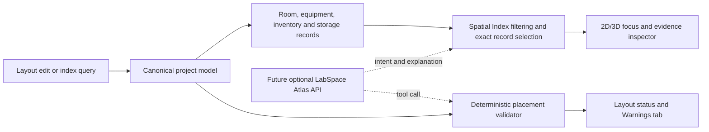

# Build Week implementation record

## Project

**LabSpace Atlas**
**Design the lab. Index every asset. Find anything instantly—in one intelligent spatial digital twin.**

Recommended track: Work and Productivity.

## Problem and product idea

Laboratories often split spatial planning, equipment records, storage indexes, and inventory across floor plans, spreadsheets, photographs, labels, and staff memory. LabSpace connects those records through one canonical spatial model. A move in the layout changes the 3D twin, validation evidence, and searchable exact location rather than creating another disconnected document.

## Competition implementation

Before Build Week, the project already had a local editor prototype, a versioned scene schema, and an early procedural asset catalog. Competition work added or substantially rebuilt:

- immutable factory-template ownership and independently persisted user Demo Rooms;
- blank-start multi-laboratory and multi-room project creation;
- synchronized material-aware 2D/3D editing, camera-preserving moves, split resizing, continuous walls, hosted openings, elevation, flips, and direct wall editing;
- exact storage hierarchies covering cabinets, shelves, drawers, compartments, and bins;
- project-wide Spatial Index search, evidence photographs, stable codes, camera navigation, and storage access previews;
- direct Layout Editor placement warnings backed by deterministic geometry validation;
- a storage-first 12-object competition template containing one BÜCHI station and assigned Shelf 01 flask evidence;
- the user's complete DEMO-01 video-showcase room as a sanitized, source-controlled fixture, while keeping the local SQLite database private;
- authored GLBs, same-geometry plan/library renders, offline decoder delivery, release validation, and regression coverage;
- competition-ready product shell, judge guide, screenshots, Devpost draft, and video script.

## Architecture

React and Zustand coordinate the editor. React Konva renders the 2D plan, React Three Fiber renders the synchronized 3D room, Zod validates versioned project data, Express exposes the local API, and Node's SQLite module persists the validated project JSON and named room versions.

## Runtime evidence boundary

The shipped Spatial Index Finder performs deterministic local filtering over stored rooms, equipment, inventory, storage locations, notes, service dates, and identifiers. Exact record selection—not generated text—drives camera focus and the evidence inspector. Placement findings come directly from the canonical validator in the Layout Editor. The runtime contains no live model provider and requires no OpenAI Platform billing.

A future optional LabSpace Atlas API may select these index and validator tools and explain their returned evidence. It is not implemented in the current runtime and must never invent records, owners, locations, maintenance facts, utilities, or safety certification.

## Human and Codex/GPT-5.6 collaboration

The user selected the laboratory problem, authored the DEMO-01 competition showcase, supplied Room 809 laboratory references, and made the product requirements, visual direction, reference priority, asset anatomy, competition narrative, and acceptance decisions. Codex/GPT-5.6 accelerated architecture, implementation, asset-generation tooling, debugging, regression tests, browser verification, release audits, and submission documentation. The primary build-session ID retained for required `/feedback` evidence is:

`019f6a4d-25a9-7812-804c-88b695589b2a`

The competition contribution is documented honestly: Codex/GPT-5.6 was central to building and validating the product rather than being falsely represented as an online runtime response.

## Current measured facts

- Factory competition template: 12 non-architectural objects.
- Rotary evaporators in that template: 1.
- Generated service/utility objects in that template: 0.
- Indexed template inventory records: 7.
- Indexed template storage locations: 15.
- Bundled DEMO-01 showcase: 50 total scene objects, including 30 placed non-architectural objects.
- Bundled DEMO-01 records: 10 inventory items, 10 equipment records, and 15 storage locations.
- Automated Vitest cases at repository preparation: 115 across 23 files.
- Full release gate: lint, strict TypeScript, asset validation, tests, and production build.

These are repository/runtime counts, not estimates of laboratory productivity impact. Search-time or usability impact should be claimed only after a timed evaluation is recorded.

## Originality, licensing, and privacy

LabSpace application code is licensed under Apache-2.0. Original authored planning assets and LabSpace media use the separate terms documented in `LICENSE-ASSETS.md` and `ASSET_LICENSES.md`. Product references informed original logo-free geometry; no private reference photographs or third-party product geometry are distributed. Local SQLite data and imported projects remain ignored by Git. DEMO-01 is the explicit exception: the user authorized this sanitized presentation room for distribution as a source-controlled fixture, with machine-local and personal data removed.

## Limitations

This submission is a single-user local prototype, not a certified laboratory-safety, BIM, or manufacturer-accurate system. Placement validation is deterministic planning guidance. Authored assets are dimension-informed planning representations. A future hosted model adapter can replace or augment the bounded intent resolver while retaining the canonical-data and deterministic-validator boundary.
